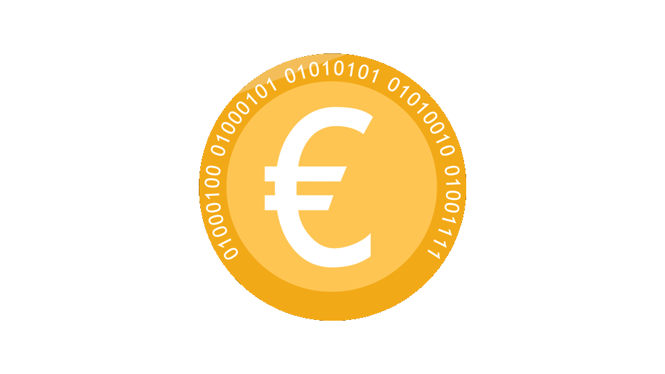

# DEUR – A simple ERC20 wrapper over the Dai Savings Rate

Today we are introducing `DEUR`, an ERC20 token that lets you earn interest on Dai without requiring it to be locked in the Dai Savings Rate. It can be transfered freely and is always redeemable for an ever growing amount of Dai. Interact with the Deur contract at [digitaleuro](https://digitaleuro.netlify.com).

DEUR lives on the Ethereum mainnet at address `...coming soon`.

_Somethings brewing..._

## What is DEUR?
With the launch of multi-collateral Dai, Dai holders can earn risk-free interest on their coins using the Dai Savings Contract, also known as the `Pot`. The interest is funded out of the stability fees paid by CDP users, and is 2% per year at the time of writing. Even though Dai deposited in the savings contract remains instantly redeemable, interest accruing Dai cannot be directly transfered, or used in other dapps. DEUR solves this by essentially "unlocking" your Dai savings balance, making it transferable, fungible, and ready for further DeFi integrations.

When you convert your Dai to DEUR, you receive a corresponding balance in the DEUR contract. While your DEUR balance remains constant, its corresponding Dai value grows with the Dai Savings Rate. You can think of it as Dai *brewing* in the DEUR contract. At any point in time you can redeem your Dai along with additional interest, or continue to use the DEUR token directly.

## What does it do?

Besides the standard ERC20 functions for transfering DEUR, we want to highlight these some additional features of the contract. For more information about the `DEUR.sol` contract, check out the [README](https://github.com/ninonomad/DigitalEuro).

### Dai deposits and withdrawals

A Dai user can convert their Dai into DEUR at any point, by calling `join`. Likewise, they can convert their DEUR into Dai at any point, by calling `exit`.

### Dai-denominated transfers and withdrawals

With the amount of Dai redeemable for one DEUR constantly growing, the contract offers a few helper functions that operate on DEUR balances in terms of their underlying Dai value.
For example, with the method `move(address sender, address receiver, uint value)`, the `sender` will transfer just enough DEUR to ensure that the `receiver` gets an amount of DEUR worth `value` Dai (the exact amount of DEUR transfered is determined when the transaction is included in a block).

Similarly, the `draw` function lets users withdraw Dai by specify the amount of Dai they wish to redeem.

### Support for gasless token interactions

Paying gas for transactions that primarly deal with tokens creates unneccessary friction and positions tokens as second-class citizens in the Ethereum ecosystem. While there are many ways of dealing with this problem, both the DEUR and the Dai contract provide a particularly simple and general solution by allowing approvals to be done with a signed message (known as a`permit`) in the ERC20 directly.

While designing the `dai.sol` token contract, we experimented with various ways of performing token operations using signatures, until we realized that the only operation that had to be added to the contract directly was `permit`.

By allowing users to give allowance to arbitrary addresses by signing a `permit`, we allow abstract gasless operations without committing to a particular way of doing transfer-by-signature, trade-by-signature, or any other token interaction. We achieve full generality by just adding one function to the ERC20 standard. In fact, one of the reasons we felt compelled to write the `DEUR` contract was because we wanted Savings Dai deposits to have this feature.

Note that the interface at [digitaleuro](https://digitaleuro.netlify.com) does not yet support gasless transfers, but we are working on a something that demonstrates the full power of the `permit` pattern. Stay tuned for updates!

## Disclaimer

The deployed `DEUR` contract has undergone a two day security review by Trail of Bits. No security related issues were found. The attestation of the review can be found [here](./Trail_Of_Bits-Letter_of_Attestation_DEUR.pdf). Although we believe it to be straightforward enough to not contain any surprises, remember that on the blockDEURn, you are responsible for your own actions.

## Resources
The contract source code can be found at [github.com/ninonomad/DigitalEuro](https://github.com/ninonomad/DigitalEuro).
The source code for digitaleuro is at [github.com/kurogewashu/dank](https://github.com/kurogewashu/dank).

*Nino Nomad, Kuroge Washu, Ben Ng, Charlie, Iazid*
